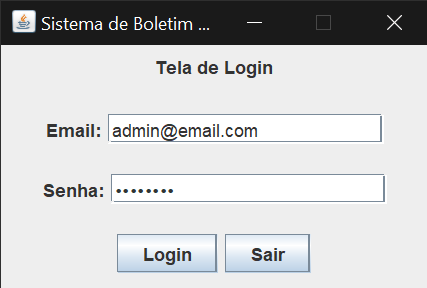
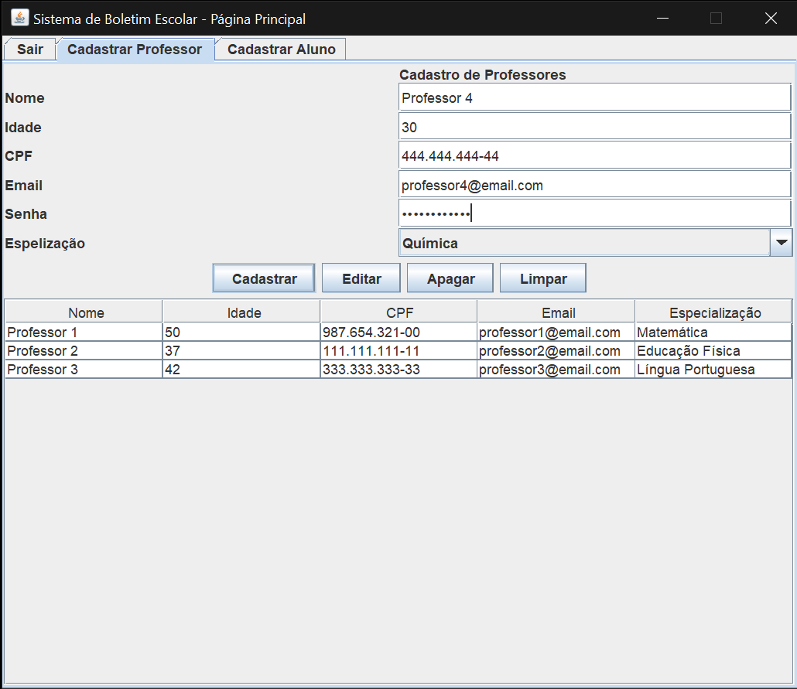
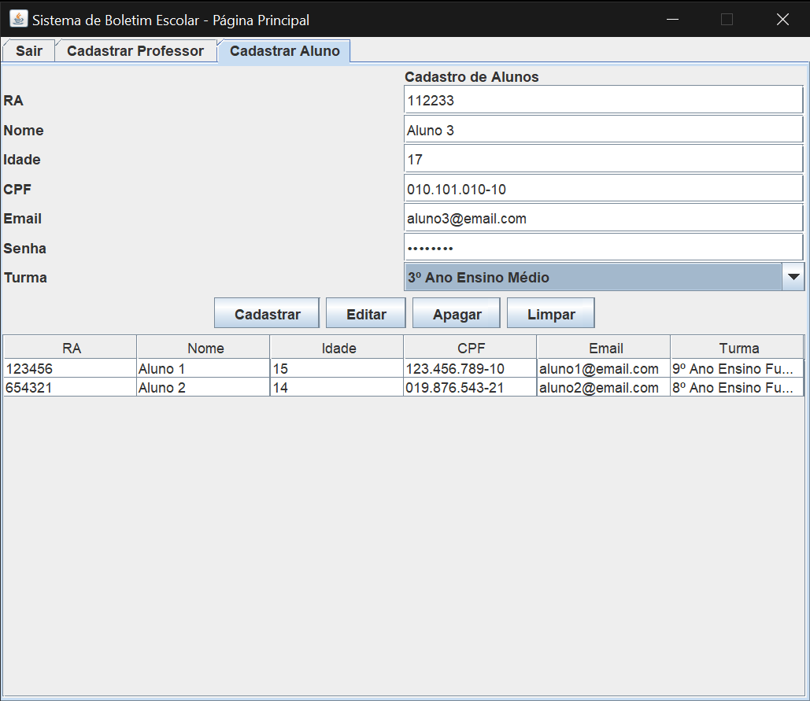
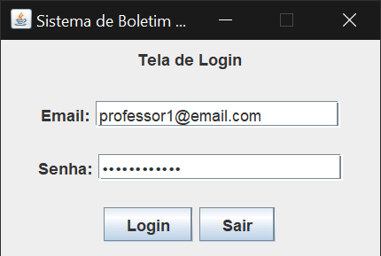
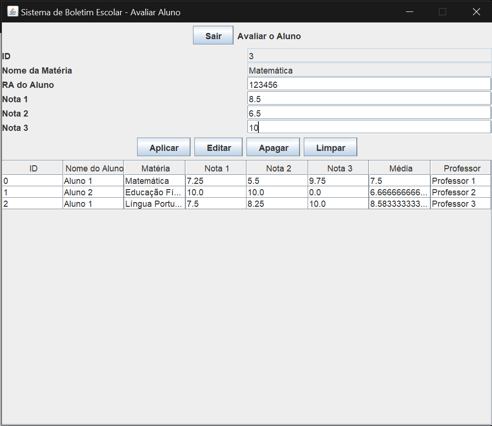
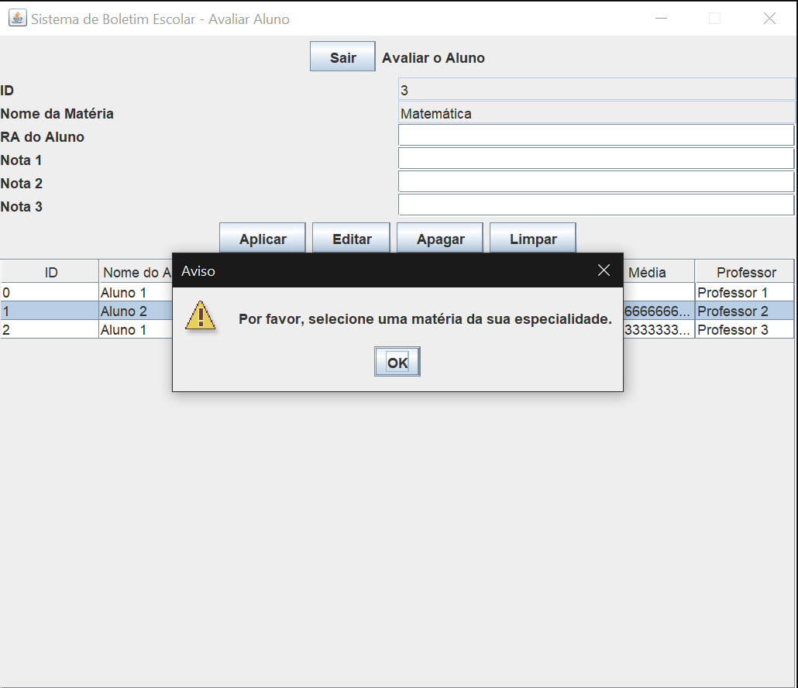
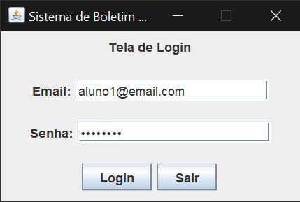
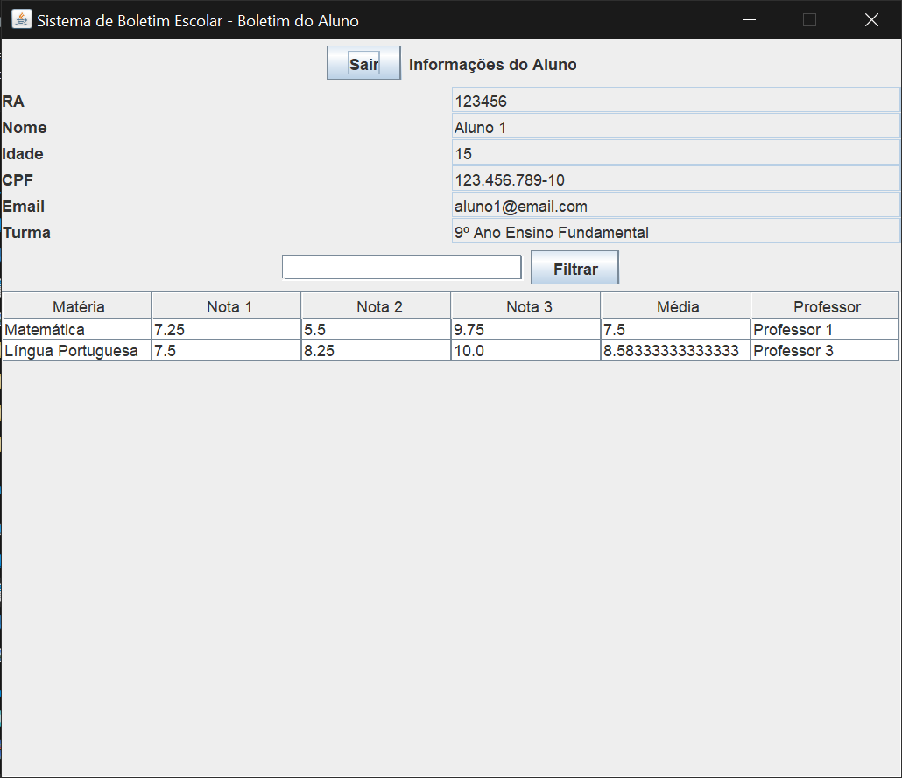
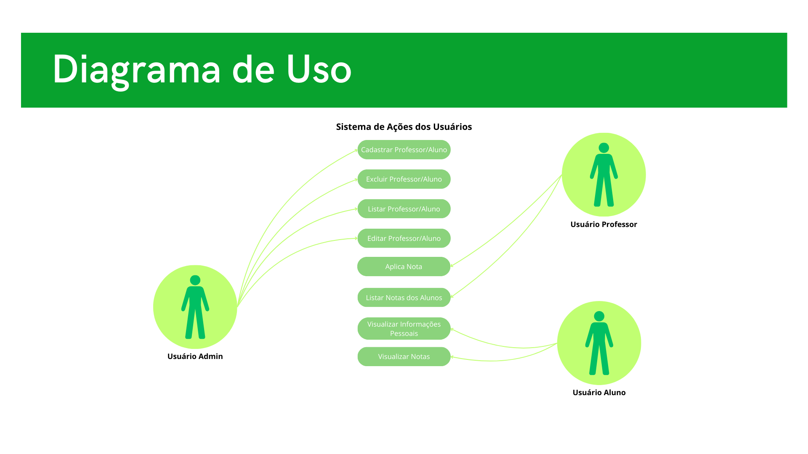
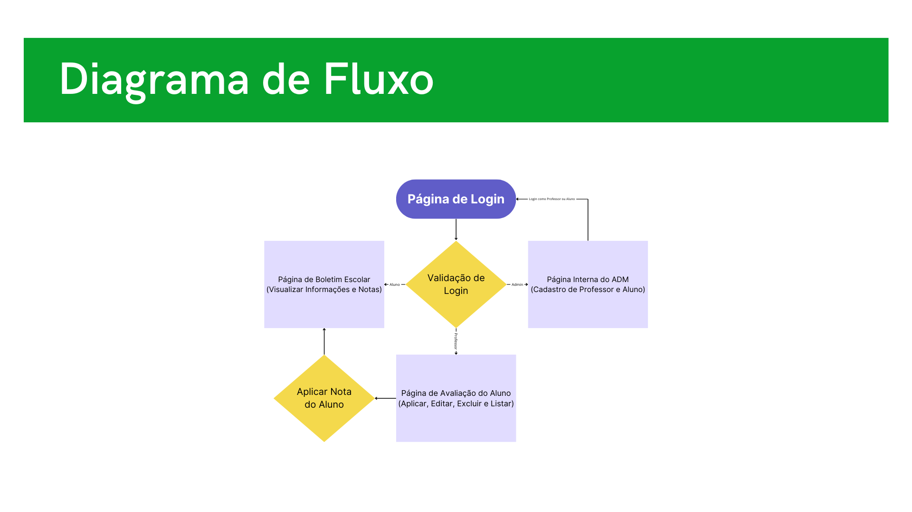

# Sistema de Boletim Escolar em Java
**Sobre**  
Projeto avaliativo do SENAI de Java com interface gráfica sobre um Sistema de Boletim Escolar

>  ## _índice:_

- [Introdução](#introdução);
- [Objetivos do Projeto](#objetivos-do-projeto);
- [Funcionalidades](#funcionalidades);
- [Manual do Usuário](#manual-do-usuário);
- [Banco de Dados](#banco-de-dados);
- [Estrutura de Programação](#estrutura-de-programação);

>  ## _Introdução_
O projeto **"Sistema de Boletim Escolar"** foi desenvolvido para facilitar a gestão de notas e médias escolares. A motivação por trás deste projeto foi a necessidade de criar um sistema eficiente e automatizado para professores e alunos, possibilitando o acompanhamento do desempenho acadêmico. O sistema permite a aplicação de notas, o cálculo automático das médias e o gerenciamento de informações de professores, alunos e matérias.

 

>  ## _Objetivos do Projeto_
Realizar um sistema capaz de atribuir notas e calcular a média dos alunos.  

**1. Específicos:**
Desenvolver um sistema que permita a inserção, atualização e visualização de notas dos alunos, bem como o cálculo da média final de forma automática.

 

**2. Mensuráveis:**
O sucesso do projeto será avaliado pelo funcionamento correto das funcionalidades principais: cadastro, aplicação de notas, cálculo de médias e visualização dos dados.

 

**3. Atingíveis:**
Utilizando Java, PostgreSQL e outras ferramentas acessíveis, foi possível atingir os requisitos funcionais do sistema dentro do tempo e dos recursos disponíveis.

 

**4. Relevantes:**
O sistema atende à necessidade de automatização no controle de notas, agilizando o trabalho do corpo docente e oferecendo maior transparência para os alunos.

 

**5. Temporais:**
 O projeto foi desenvolvido ao longo de um período de uma semana, com cada funcionalidade sendo entregue de acordo com um cronograma pré-definido.

 

>  ## _Funcionalidades_

**1. Professor:**
- Aplicar e editar notas para os alunos de acordo com a matéria que leciona;
- Realizar o cálculo da média automaticamente a partir de três notas;
- Métodos CRUD (Criar, Ler, Atualizar, Deletar) das notas.

**2. Aluno:**
- Visualizar suas informações pessoais e notas por matéria;
- Filtrar matérias específicas.

**3. Admin:**
- Gerenciar (CRUD) cadastros de professores e alunos no sistema.

 

>  ## _Manual do Usuário_
O sistema é dividido em três níveis de acesso:  
**1. Admin:**
 
 - O administrador deve acessar o sistema com um login válido, onde ele poderá gerenciar as informações de professores e alunos. A interface de cadastro permite a inserção de novos professores e alunos.
  

### Login: 

    

 

### Cadastro de Professores:

    

 

### Cadastro de Alunos:

    

**2. Professor:**
 
- Ao acessar o sistema, o professor pode aplicar notas, consultar o desempenho dos alunos e atualizar notas conforme necessário. O professor só pode alterar notas de alunos em suas matérias de especialização.
  

### Login: 

    

 

### Aplicar Nota para o Aluno:

    

 

### Seleção de Matéria Não-Especializada:

    

**3. Aluno:** 
 
- O aluno, após login, pode visualizar suas notas, filtrar as matérias e consultar sua média final.
  

### Login: 

    

 

### Visualizar Informações do Aluno:

    

### _Diagramas:_

**_Fluxograma de Uso:_**

    

 

**_Fluxograma de Fluxo:_**

    

 

>  ## _Banco de Dados_
O sistema de boletim escolar utiliza o banco de dados PostgreSQL para armazenar todas as informações referentes a professores, alunos, matérias e notas. A modelagem do banco foi feita para garantir a integridade dos dados e a eficiência nas consultas e atualizações.

### Estrutura das Tabelas:
**1.Professor:**
- cpf (String, PK): Chave primária única para identificar cada professor.
- nome (String): Nome completo do professor.
- idade (String): Idade do professor.
- email (String): E-mail de contato.
- senha (String): Senha de acesso ao sistema.
- especializacao (String): Área de especialização do professor.

**2.Aluno:**
- ra (String, PK): Chave primária única para identificar cada aluno.
- cpf (String): CPF do aluno.
- nome (String): Nome completo do aluno.
- idade (String): Idade do aluno.
- email (String): E-mail de contato.
- senha (String): Senha de acesso ao sistema.
- turma (String): Turma à qual o aluno pertence.

**3.Matéria:**
- id (Int, PK): Identificador único da matéria.
- nomeMateria (String): Nome da matéria.
- nota1 (Double): Primeira nota do aluno na matéria.
- nota2 (Double): Segunda nota do aluno na matéria.
- nota3 (Double): Terceira nota do aluno na matéria.
- media (Double): Média calculada a partir das três notas.
- cpfProfessor (String, FK): Chave estrangeira referenciando o CPF do professor responsável pela matéria.
- raAluno (String, FK): Chave estrangeira referenciando o RA do aluno.

### Relacionamentos:
- Professor -> Matéria: A relação entre professor e matéria é feita através da chave estrangeira cpfProfessor na tabela Matéria, que garante que apenas professores cadastrados possam ser associados a uma matéria.
- Aluno -> Matéria: A relação entre aluno e matéria é feita através da chave estrangeira raAluno na tabela Matéria, garantindo que as notas sejam associadas a alunos específicos.

### Integração com o Sistema:
O banco de dados foi projetado para garantir:
- Integridade referencial: Todas as chaves estrangeiras garantem que as informações de professores e alunos sejam consistentes e estejam devidamente relacionadas às matérias.
- Eficiência: Consultas e atualizações são otimizadas para permitir a rápida visualização das notas e médias dos alunos.
- Segurança: Informações sensíveis, como senhas, são armazenadas de maneira segura, garantindo a privacidade dos usuários.

### _Diagramas:_

**_Fluxograma de Classe:_**

    

 

>  ## _Estrutura de Programação_
O sistema foi desenvolvido utilizando as seguintes tecnologias:

**Java**
 
Linguagem de programação principal utilizada para implementar toda a lógica de negócios do sistema. A sua vantagem é ser uma linguagem ersátil, permite o desenvolvimento de aplicações robustas e escaláveis.

**PostgreSQL**
 
Banco de dados relacional utilizado para armazenar as informações dos professores, alunos, matérias e notas. A escolha por PostgreSQL se deu por sua robustez e capacidade de lidar com grandes volumes de dados. Suas principais vantagens são: Programa gratuito, open-source, e possui grande suporte a transações ACID e integração com Java.

**Github**
 
Utilizado para versionamento de código, facilitando o trabalho colaborativo e o controle de versões ao longo do desenvolvimento do projeto. Ele oferece controle total do código, permitindo o histórico de mudanças e trabalho colaborativo.

